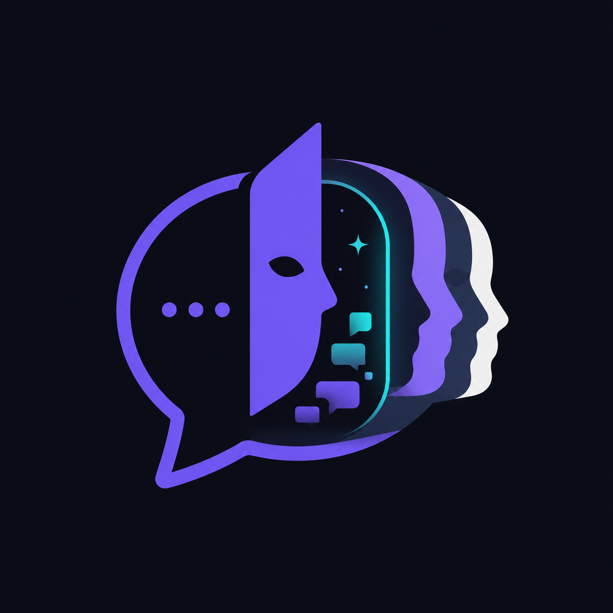
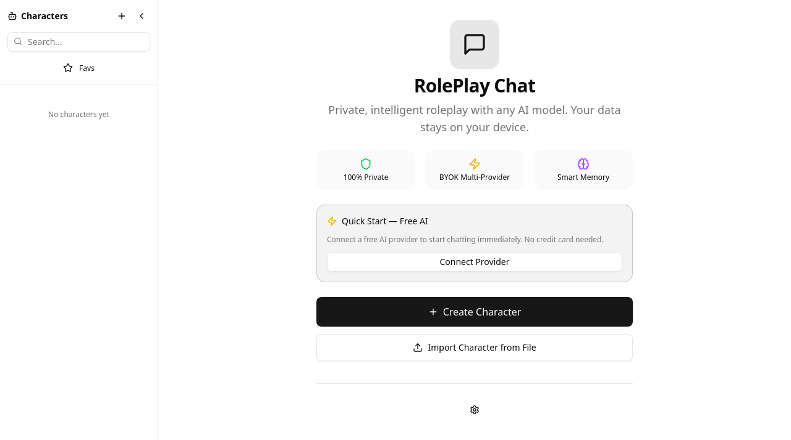
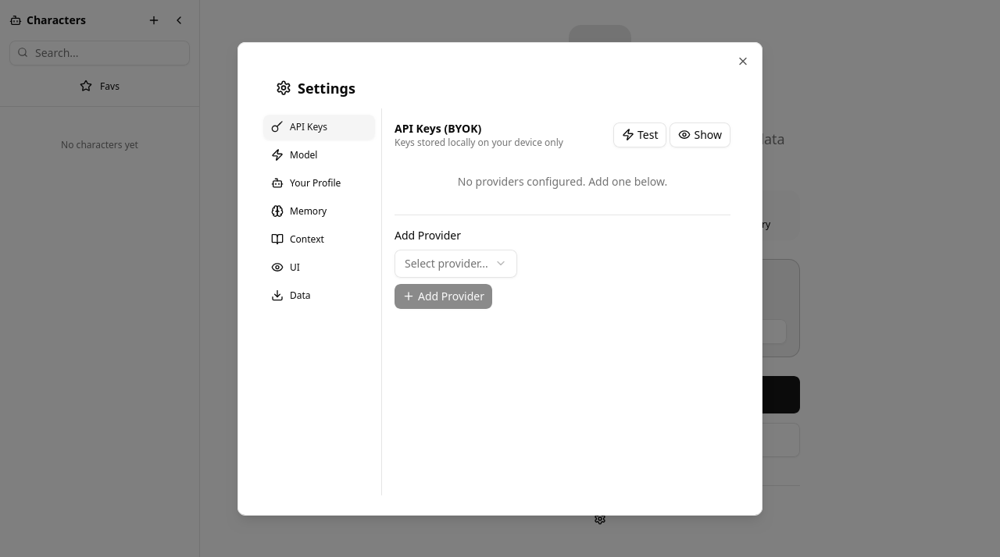

<div align="center">
  
</div>

<h1 align="center">RolePlay Chat</h1>

<div align="center">
  
  <br/>
  <sub><i>Light mode — Private, intelligent roleplay, fully client-side</i></sub>
</div>

<br/>

<p align="center">
  A private, client-side AI roleplay chat application. All data stays in your browser — <strong>no servers, no tracking, no accounts required.</strong>
</p>

<div align="center">
  <a href="https://roleplay-6hg.pages.dev/"><strong>→ Live Demo</strong></a>
  &nbsp;&nbsp;|&nbsp;&nbsp;
   Dark mode available
</div>

<br/>

---

<br/>

## Features

### AI Providers & Models
- **Multi-provider support** — OpenAI, Anthropic, Google, Groq, Mistral, OpenRouter, NVIDIA NIM, local LLMs (Ollama, LM Studio, llama.cpp), and any custom OpenAI-compatible endpoint
- **80+ pre-configured models** with context window info, streaming support, and vision capabilities
- **Custom model IDs** — enter any model string not in the preset list
- **Bring Your Own Key** — API keys stored locally in IndexedDB, never sent anywhere except the provider

### Character Management
- Create and edit AI personas with rich metadata (name, description, personality, scenario, speech patterns, knowledge, likes/dislikes, behavior)
- **AI-assisted character generation** — generate characters via LLM
- **Import/Export** using the CharacterCard V2 spec (`.json` / `.charx` files)
- Favorites system, search, and tag filtering
- Pre-built character templates (Fantasy Mage, Sci-Fi Android, Medieval Knight, Noir Detective, etc.)

### Chat System
- Multiple concurrent chats per character, auto-titled from first message
- **Streaming responses** with real-time token display
- **Message regeneration** — delete last user+assistant turn and retry
- **Stop streaming** with abort controller
- **Copy message text** to clipboard
- **Delete individual messages**
- Auto-scroll with user-scroll detection
- Image lightbox for character avatars

### Memory System
- **Automatic memory extraction** — AI analyzes conversations and extracts facts, events, emotions, preferences, and instructions
- **Per-chat memory isolation** — each chat maintains its own independent memory
- **Relevance scoring** — keyword matching, recency decay, importance weighting, and access frequency
- **Memory decay** — memories expire after 90 days; low-importance ones decay after 30 days
- **Memory panel** — view, filter, and delete stored memories
- Memory is automatically cleaned up when a chat is deleted

### Context Condensation
- Smart summarization to maintain long conversations within token limits
- Keeps recent messages verbatim, summarizes older ones
- Configurable context window size and summarization threshold
- Per-message token estimation with CJK/Unicode awareness

### Image Generation
- **Scene image generation** via NVIDIA NIM (Stable Diffusion 3 Medium, SDXL, FLUX.1 Dev/Schnell/Klein)
- **AI prompt enhancement** — LLM expands short prompts into detailed generation prompts
- Inline image display with lightbox zoom

### UI/UX
- **Dark / Light / System theme** toggle
- **Fully responsive** — mobile nav sheet, touch-friendly targets, gesture handling
- **Custom context menus** — right-click and long-press on mobile
- **Setup wizard** for first-time users
- **Custom confirm dialogs** for destructive actions (no native `alert()`/`confirm()`)
- Toast notifications
- Collapsible sidebars (character list, chat history)
- Markdown-like formatting in messages (bold, italic, quoted dialogue)
- Quick model switcher from the chat input bar

### Data Privacy
- All data stored locally in **IndexedDB** (characters, chats, messages, memories, settings)
- **Full data export/import** as JSON
- **Clear all data** option
- No server-side storage, no tracking, no analytics

## Tech Stack

| Category | Technology |
|---|---|
| **Framework** | Next.js 16 (App Router, static export) |
| **Language** | TypeScript |
| **Styling** | Tailwind CSS v4 + shadcn/ui |
| **UI Primitives** | Radix UI (Dialog, Select, DropdownMenu, Tooltip, Sheet, AlertDialog, etc.) |
| **State Management** | Zustand |
| **Database** | IndexedDB (vanilla, no ORM) |
| **Icons** | Lucide React |
| **Theme** | next-themes |

## Getting Started

### Prerequisites

- Node.js 18+
- npm
- API keys for your preferred AI provider

### Installation

```bash
# Clone the repository
git clone <repository-url>
cd roleplay-chat

# Install dependencies
npm install

# Start development server
npm run dev
```

Open [http://localhost:3000](http://localhost:3000) in your browser.

### Build for Production

```bash
npm run build
```

The output is a static site in the `out/` directory — deploy it to any static host (Cloudflare Pages, GitHub Pages, etc.).

### Available Scripts

| Script | Description |
|---|---|
| `npm run dev` | Start dev server on port 3000 (output teed to `dev.log`) |
| `npm run build` | Build for production (static export) |
| `npm run lint` | Run ESLint |

## Configuration

1. Open the app and complete the setup wizard (or open **Settings** from the sidebar)
2. Add your API provider credentials (API key and endpoint URL)
3. Select your preferred model
4. Optionally configure your user persona — this name is used in memory transcripts and system prompts

## Deployment

### Cloudflare Pages (Recommended)

The live demo runs on Cloudflare Pages. Push the `out/` directory after `npm run build`.

### Cloudflare Worker Proxy

A Cloudflare Worker (`cloudflare-worker.js`) is included to proxy requests to NVIDIA NIM APIs, handling CORS and routing for both chat completions and image generation. Deploy it alongside the static site.

### Caddy Reverse Proxy

A `Caddyfile` is included for local reverse proxy setups (port 81 → localhost:3000 with dynamic port forwarding support).

## Project Structure

```
├── cloudflare-worker.js      # CF Worker proxy for NVIDIA NIM APIs
├── wrangler.toml             # CF Workers config
├── Caddyfile                 # Caddy reverse proxy config
├── next.config.ts            # Next.js config (static export)
├── src/
│   ├── app/
│   │   ├── layout.tsx        # Root layout (fonts, theme, toaster)
│   │   ├── page.tsx          # Main app component (single-page)
│   │   └── globals.css       # Tailwind v4 + CSS variables
│   ├── components/
│   │   ├── ui/               # 30+ shadcn/ui components
│   │   ├── theme-toggle.tsx
│   │   └── custom-context-menu.tsx
│   ├── hooks/
│   │   ├── use-mobile.ts     # Breakpoint detection + gestures
│   │   ├── use-toast.ts
│   │   └── use-context-menu.tsx
│   ├── lib/
│   │   ├── ai-engine.ts      # Multi-provider AI engine (80+ models)
│   │   ├── context.ts        # Context condensation system
│   │   ├── memory.ts         # Memory extraction & retrieval
│   │   ├── db.ts             # IndexedDB CRUD layer
│   │   ├── types.ts          # TypeScript type definitions
│   │   └── utils.ts          # cn() utility
│   └── stores/
│       ├── chat-store.ts     # Main Zustand store
│       ├── settings-store.ts # Settings store
│       └── context-menu-store.ts
└── public/
    └── logo.png              # App favicon
```

## License

This software is licensed under a **proprietary license**. See the [LICENSE](LICENSE) file for full terms.

### Permitted Use

- Personal and non-commercial use
- Educational and research purposes
- Private, non-public deployments

### Prohibited Use

**You may NOT use this software:**

- For any commercial purposes or business activities
- To provide services to third parties (whether free or paid)
- In any product or service that competes with this project
- To build a competing SaaS or hosted service
- For any illegal or unauthorized purposes

---

## For Developers

This is a [Next.js 16](https://nextjs.org/) App Router project with static export, built with TypeScript and Tailwind CSS v4.

| Area | Details |
|---|---|
| **Data layer** | IndexedDB via vanilla CRUD helpers in [`src/lib/db.ts`](src/lib/db.ts) — no ORM |
| **State** | Zustand stores in [`src/stores/`](src/stores/) |
| **AI engine** | Multi-provider abstraction in [`src/lib/ai-engine.ts`](src/lib/ai-engine.ts) supporting 80+ models |
| **Memory system** | Automatic extraction & retrieval in [`src/lib/memory.ts`](src/lib/memory.ts) |
| **Build output** | Static site to `out/` — deploy anywhere |

Key files:

- [`src/lib/types.ts`](src/lib/types.ts) — all TypeScript interfaces & types
- [`src/lib/db.ts`](src/lib/db.ts) — IndexedDB operations
- [`src/lib/ai-engine.ts`](src/lib/ai-engine.ts) — AI provider abstraction
- [`src/lib/memory.ts`](src/lib/memory.ts) — memory extraction & retrieval
- [`src/stores/chat-store.ts`](src/stores/chat-store.ts) — main Zustand store
- [`src/app/page.tsx`](src/app/page.tsx) — single-page entry point
- [`src/app/globals.css`](src/app/globals.css) — Tailwind v4 + theme variables

> **Architecture note:** The app is a pure client-side SPA. Next.js `output: "export"` generates a fully static site — no Node server, no API routes, no SSR. Everything runs in the browser.

---

*If you are interested in commercial licensing or enterprise deployments, please contact the project maintainer.**
